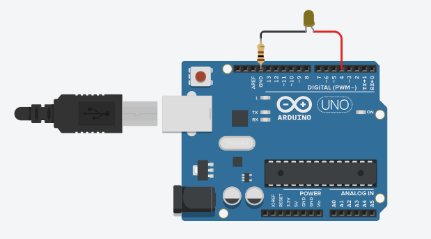

# Timers on ATmega328p

Designing a program that uses a timer in CTC mode to blink an LED every 1 second, i.e., the LED stays on for one second and off for one second, we will explore the timer functionality on the ATmega328p.

## 🤖 Settings

|Simulation|
|----------|

> 1. *In the preview and schematic built in tinkercad and shown above, it is necessary to note that the Arduino Uno was used with the ATMega328p microcontroller. However, this assembly was only used for simulation. The circuit structure followed the same for the laboratory with the difference that the Arduino used in practice for the experiment was the Arduino Mega with ATMega2560 microcontroller.*

## Implementation in C

```c
#include <avr/io.h>
#include <avr/interrupt.h>

int main(void){
  sei();

  DDRD |= (1 << PD4);

  OCR1A = 0x7A18; // Timer/Counter1 contará até 31256 em 1s
  TCCR1B |= (1 << WGM12) | (1 << CS12); // Modo CTC e clk(I/O)/256 (from prescaler)
  TIMSK1 |= (1 << OCIE1A); // Timer/Counter1 comparação de saída A

  while(1);
  
  return 0;
}

ISR(TIMER1_COMPA_vect) {
  PORTD ^= (1 << PD4); // inverte o estado do led
}
```
Steps of the code:

1. Include the necessary libraries.
2. Enable global interrupts.
3. Configure the pin as an output to control the LED. The pin we are using is PD4 (Port D, Pin 4).
4. Configure the OCR1A register to set the comparison value of timer/counter 1 so that it counts up to 31256 before triggering an interrupt. This is done to create a 1-second interval.
5. Set the TCCR1B register to enable CTC mode (WGM12) and set the clock division to clk(I/O)/256 using the prescaler (CS12).
6. Configure the TIMSK1 register to enable the interrupt for comparison output A of timer/counter 1.
7. Inside the while(1) loop, the program enters an infinite loop, waiting for interrupts to occur.
8. Outside of the main() function, there is an interrupt routine ISR(TIMER1_COMPA_vect) that toggles the LED state (on or off) when the comparison output A interrupt is triggered.

## 🔬 Prática Laboratorial

In laboratory practice we work on analyzing the generation of signals using the timer, in the practical and basic example of turning on an LED. See our results by accessing [link]().

## ✍️ Authors

- [Ernane Ferreira](https://github.com/ernanej) 🧑🏼‍💻
- [Quelita Míriam](https://github.com/quelita2) 👩🏼‍💻
- [Thiago Lopes](https://github.com/thiagonasmto) 🧑🏼‍💻

---

<div align="center">
  DCA0119 - Digital Systems (2023.1) <br/>
  Federal University of Rio Grande do Norte - Department of Computer and Automation Engineering (DCA).
</div>
